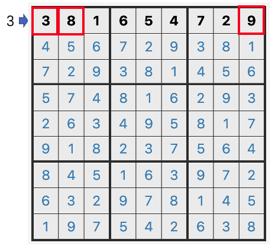

# 常见规则说明

## 1~9填充
单一区域内填入 1-9，并且每个数字恰好出现 1 次。

## 1~9不重复
单一区域内填入 1-9，每个数字出现 0 或 1 次。

## 摩天楼
摩天楼规则需要一定的空间想象力，对以下内容进行对应理解：
- 数独盘面 → 平地
- 数独盘面内的数字 → 位于该位置上的楼的层数
- 9 宫摩天楼数独的解 → 平地上有 81（9*9）栋高低不同的楼，其中 9 层高的楼有 9 栋，8 层高的楼有 9 栋，...，1 层高的楼也有 9 栋
- 摩天楼观测提示数 → 从提示数所在观测位，在指定方向可以看到的楼栋数（即[摩天楼观测数](#摩天楼观测数)）

## 摩天楼观测数
摩天楼观测数是：在摩天楼数独规则下，在指定（观测位，观测方向）上，可以看到的楼栋的数量。

注意：存在高楼挡住矮楼，导致矮楼无法被看到的情况。

> 举例：
> - 盘面信息：
>   - A 行的数字从左到右为：381654729
> 
> - 观测信息：
>   - 从 A0（A1 左侧），向右观测
> 
> - 观测结果：可以看到 `3` 栋楼，分别是 3 层楼（A1）、8 层楼(A2)、9 层楼(A9)
>   - A1(3层楼)：可以看到
>   - A2(8层楼)：可以看到，8 层楼高于 3 层楼（8>3）
>   - A3(1层楼)：无法看到，被 8 层楼挡住（1<8）
>   - A4(6层楼)：无法看到，被 8 层楼挡住（6<8）
>   - A5(5层楼)：无法看到，被 8 层楼挡住（5<8）
>   - A6(4层楼)：无法看到，被 8 层楼挡住（4<8）
>   - A7(7层楼)：无法看到，被 8 层楼挡住（7<8）
>   - A8(2层楼)：无法看到，被 8 层楼挡住（2<8）
>   - A9(9层楼)：可以看到，9 层楼高于 8 层楼（9>8）
> 
> - 结论：
>   - 此例中，A0 位向右观测的`摩天楼观测数` 是 `3`
> 

## 奇偶星
- 区域：中心格 及其[共边邻格]，一般标记中心格
- 限制：中心格与其[共边邻格]奇偶性相反

## 邻格
两格拥有公共的点，则互为"邻格"。
对于标准 9 宫数独：
- A1,A9,I1,I9：有 3 个邻格
- {A,I}{2-8}，{B-H}{1,9}：有 5 个邻格
- {B-H}{2-8}：有 8 个邻格

## 共边邻格
两格拥有公共的边，则互为"共边邻格"。
对于标准 9 宫数独：
- A1,A9,I1,I9：有 2 个共边邻格
- {A,I}{2-8}，{B-H}{1,9}：有 3 个共边邻格
- {B-H}{2-8}：有 4 个共边邻格

> 引用：
> - BiliBili：[15：摩天楼数独](https://www.bilibili.com/read/cv10181180)

[共边邻格]: #共边邻格