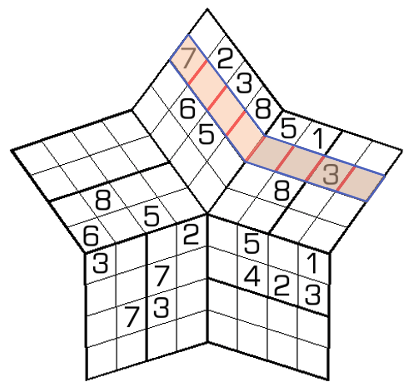
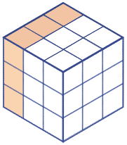
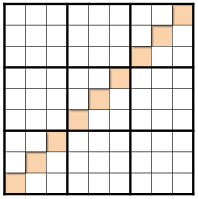

# 常见规则说明

## 共边平行路
一个区域内，所有邻格的公共边互相平行

### 棱
魔方中的[共边平行路]

## 上斜线
左下到右上的斜线区域

## 下斜线
左上到右下的斜线区域

## 1~9填充
- 单一区域内填入 `1-9`
- 每个数字恰好出现 1 次。

## 1~8填充
- 单一区域内填入 `1-8`
- 每个数字恰好出现 1 次。

## 1~6填充
- 单一区域内填入 `1-6`
- 每个数字恰好出现 1 次。

## 9选6填充
- 在 `1-9` 中挑选 6 个数，单一区域内填入
- 每个数字恰好出现 1 次。

## 全盘9选6填充
在 `1-9` 中挑选 6 个数，全盘仅出现这 6 种不同的数字。

## 1~9不重复
- 单一区域内填入 `1-9`
- 每个数字出现 0 或 1 次。

## 0~9不重复
- 单一区域内填入 `0-9`
- 每个数字出现 0 或 1 次。

## 摩天楼
摩天楼规则需要一定的空间想象力，对以下内容进行对应理解：
- 数独盘面 → 平地
- 数独盘面内的数字 → 位于该位置上的楼的层数
- 9 宫摩天楼数独的解 → 平地上有 `81`栋高低不同的楼，其中 9 层高的楼有 `9` 栋，8 层高的楼有 `9` 栋，...，1 层高的楼也有 `9` 栋
- 摩天楼观测提示数 → 从提示数所在（观测位，观测方向）上，可以看到的楼栋数（即[摩天楼观测数](#摩天楼观测数)）
- 摩天和提示数 → 从提示数所在（观测位，观测方向）上，可以看到的楼的总层数（即[摩天和](#摩天和)）

> 注意：存在高楼挡住矮楼，导致矮楼无法被看到的情况。

## 摩天楼观测数
在摩天楼数独规则下，在指定（观测位，观测方向）上，可以看到 N 栋楼。`摩天楼观测数`是可以看到的楼栋数，即`N`。

## 摩天和
在摩天楼数独规则下，在指定（观测位，观测方向）上，可以看到 N 栋楼。`摩天和`是这 N 栋楼的层数总和。

> 举例：
> - 盘面信息：
>   - A 行的数字从左到右为：381654729
>   - 
> - 观测信息：
>   - 从 `A0`（A1 左侧），向右观测
>   - 
> - 观测结果：可以看到 `3` 栋楼，分别是 3 层楼（`A1`）、8 层楼(`A2`)、9 层楼(`A9`)
>   - `A1`(3层楼)：可以看到
>   - `A2`(8层楼)：可以看到，8 层楼高于 3 层楼（8>3）
>   - `A3`(1层楼)：无法看到，被 8 层楼挡住（1<8）
>   - `A4`(6层楼)：无法看到，被 8 层楼挡住（6<8）
>   - `A5`(5层楼)：无法看到，被 8 层楼挡住（5<8）
>   - `A6`(4层楼)：无法看到，被 8 层楼挡住（4<8）
>   - `A7`(7层楼)：无法看到，被 8 层楼挡住（7<8）
>   - `A8`(2层楼)：无法看到，被 8 层楼挡住（2<8）
>   - `A9`(9层楼)：可以看到，9 层楼高于 8 层楼（9>8）
>   - 
> - 结论：此例中，`A0` 位向右观测的
>   - `摩天楼观测数` 是 `3`
>   - `摩天和` 是 `20`=3+8+9
>   - 

## 邻格
两格拥有公共的点，则互为`邻格`。

对于标准 9 宫数独：
- `A1`,`A9`,`I1`,`I9`：有 3 个邻格
- `{A,I}{2-8}`，`{B-H}{1,9}`：有 5 个邻格
- `{B-H}{2-8}`：有 8 个邻格

## 共边邻格
两格拥有公共的边，则互为`共边邻格`。

对于标准 9 宫数独：
- `A1`,`A9`,`I1`,`I9`：有 2 个共边邻格
- `{A,I}{2-8}`，`{B-H}{1,9}`：有 3 个共边邻格
- `{B-H}{2-8}`：有 4 个共边邻格

## 对角邻格
两格拥有公共的点，但不存在公共的边，则互为`对角邻格`。

对于标准 9 宫数独：
- `A1`,`A9`,`I1`,`I9`：有 1 个对角邻格
- `{A,I}{2-8}`，`{B-H}{1,9}`：有 2 个对角邻格
- `{B-H}{2-8}`：有 4 个对角邻格

## 连续
如果两格满足`连续`约束，说明这两格数字差为 1

## 正交连续
如果[共边邻格]的公共边上存在标记，说明这两格数字差为 1

## 斜连续
如果[对角邻格]的公共顶点上存在标记，说明这两格数字差为 1

## 黑白点
如果[共边邻格]的公共边上存在黑白点标记，说明这两格数字大小满足：
- 黑点：两格数字是两格关系
- 白点：两格数字差为 1（即[连续]）
> 注意：`1`和`2`之间可能标记黑点，也可能标记白点

## 数比
两格之间存在大小标志，说明这两个数字满足以下情况之一：
- `=`：两格数字相同
- `>`：开口方向格 大于 闭口方向格
- `⊿`：斜边所在格 大于 直角方向格

## 无缘
对于数字 `A`：
- 盘面内任意一个数字`A`，它的[邻格]都不是数字 `A`

## 马步
两格的横向距离和纵向距离，一个是`1`，一个是`2`，则互为`马步`格。

对于标准 9 宫数独：
- `A1`,`A9`,`I1`,`I9`：有 2 个马步格
- `{A,I}{2,8}`，`{B,H}{1,9}`：有 3 个马步格
- `B2`,`B8`,`H2`,`H8`,`{A,I}{3-7}`，`{C-G}{1,9}`：有 4 个马步格
- `{B,H}{3-7}`，`{C-G}{2,8}`：有 6 个马步格
- `{C-G}{3-7}`：有 8 个马步格

马步约束：两格互为马步格，且数字相同

马步中心：满足`马步约束`的两格的中点

## 前X和
盘外提示数 S：当前位置向盘内看，第 1 格为`X`，前 X 格和为`S`

## 边框和
盘外提示数 S: 当前位置向盘内看，前 3 格的和为 `S`

## 奇偶星
- 区域：中心格 及其[共边邻格]，一般标记中心格
- 限制：中心格与其[共边邻格]奇偶性相反

> 引用：
> - BiliBili：[15：摩天楼数独](https://www.bilibili.com/read/cv10181180)

[共边邻格]: #共边邻格
[对角邻格]: #对角邻格
[邻格]: #邻格
[连续]: #连续
[斜连续]: #斜连续
[共边平行路]: #共边平行路